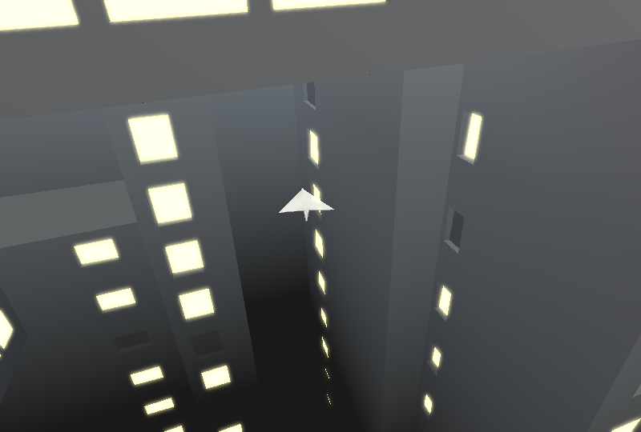

# (untitled-3)

Author: Rain Du

Design: The point is really just to fly around and look at the environment, but if the player gets bored they can pick up the colored package and deliver it to the window of the same color.

Screen Shot:

How To Play:

`wasd`: dive down, lift up, turn left, turn right

`space`: toggle display text

`escape`: take a screenshot

Known issues: I'm not happy with the behavior of the camera when it gets close to any obstacle.. And the package/letter doesn't look like a package/letter...Also the frame rate makes me sweat.

(ps: this last commit is made on 10/1 afternoon, changes include minor adjustment to camera position and saving a bunch of screenshots. It can totally be reverted back to the previous commit when being graded, if necessary.)

Sources:

The look is heavily inspired by game Inside. [Here](https://www.gdcvault.com/play/1023304/Low-Complexity-High-Fidelity-INSIDE)'s a talk on its graphics. 

I followed these tutorials [(1)](https://learnopengl.com/Advanced-Lighting/Bloom) and [(2)](https://open.gl/framebuffers) to implement bloom. And thank Jim for helping me debug, otherwise I'd probably still be panicking right now (or given up)

This game was built with [NEST](NEST.md).
